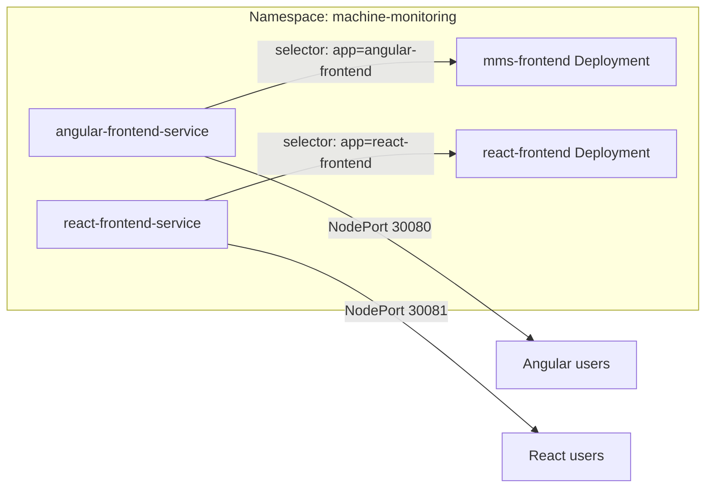

# Deploy React Frontend Alongside Angular (Same Namespace)

## Main idea

Keep the existing Angular deployment and add **a second set of resources** for the React app, organized in **separate folders** (`angular/` and `react/`) to align with separate GitHub repos and CI/CD. Both stacks live in `machine-monitoring` and stay independent via **different resource names**, **labels/selectors**, and **NodePorts**.



---

## Key points

### 1. No naming conflicts (Kubernetes resources)

- **Angular (current):**
  - Deployment: `mms-frontend`
  - Service: `angular-frontend-service`
- **React (new):**
  - Deployment: use a distinct name, e.g. `mms-frontend-react` or `react-frontend`
  - Service: e.g. `react-frontend-service`

Resource names are unique within the namespace, so both can coexist.

### 2. Isolate traffic with labels and selectors

- Angular: `app: angular-frontend` (Deployment + Service selector) — in [base/frontend/angular/](base/frontend/angular/) after restructure.
- React: use `app: react-frontend` on the React Deployment’s pod template and Service’s `selector`.  

This way each Service only sends traffic to its own pods.

### 3. Different NodePort for external access

- Angular Service uses `nodePort: 30080` (in `base/frontend/angular/service.yaml`).
- Assign React `nodePort: 30081` in `base/frontend/react/service.yaml` (valid range 30000–32767).

Then: `http://<node-ip>:30080` → Angular, `http://<node-ip>:30081` → React.

### 4. Separate image and deploy script per app

- **Image:** React Deployment points to the React image (e.g. `ghcr.io/.../mms-ui-react:1.0.0-dev` or your React repo's image). Angular keeps its current image in its folder.
- **Deploy:** Each folder has its own deploy script so each GitHub repo's CI can run only its script:
  - `base/frontend/angular/deploy-frontend.sh` — applies Angular manifests, patches Angular image.
  - `base/frontend/react/deploy-frontend.sh` (or `deploy-frontend-react.sh`) — applies React manifests, patches React image.

Base [base/deploy.sh](base/deploy.sh) does not reference the frontend; no change there unless you want a single entrypoint that deploys both frontends.

### 5. Folder layout (chosen approach)

Use **separate subdirs** so each app (and its repo) has a clear boundary:

```
base/frontend/
├── angular/
│   ├── deployment.yaml    # Deployment name: mms-frontend, label: app=angular-frontend
│   ├── service.yaml       # angular-frontend-service, nodePort 30080
│   └── deploy-frontend.sh # patches image, applies deployment + service
└── react/
    ├── deployment.yaml    # e.g. mms-frontend-react, label: app=react-frontend
    ├── service.yaml       # react-frontend-service, nodePort 30081
    └── deploy-frontend.sh # patches React image, applies deployment + service
```

- **Angular:** Move current [base/frontend/frontend-deployment.yaml](base/frontend/frontend-deployment.yaml), [base/frontend/frontend-service.yaml](base/frontend/frontend-service.yaml), and [base/frontend/deploy-frontend.sh](base/frontend/deploy-frontend.sh) into `base/frontend/angular/`, renaming to `deployment.yaml` and `service.yaml`. Update the deploy script so it references `deployment.yaml` and `service.yaml` in the same directory.
- **React:** Add `base/frontend/react/deployment.yaml`, `service.yaml`, and a deploy script (same pattern as Angular, with React image and resource names).

---

## Summary table

| Concern            | Angular (existing)     | React (new)                |

|--------------------|------------------------|----------------------------|

| Deployment name    | `mms-frontend`         | e.g. `mms-frontend-react`  |

| Service name       | `angular-frontend-service` | e.g. `react-frontend-service` |

| Label / selector   | `app: angular-frontend`    | `app: react-frontend`      |

| NodePort           | 30080                  | 30081 (or another free)    |

| Container image    | Current GHCR Angular image | Your React image           |

No Ingress or other references to the frontend were found in `base/`; if you add Ingress later, give each app a different host or path and point to the corresponding Service.

If you want, next step can be concrete YAML snippets and a minimal `deploy-frontend-react.sh` tailored to your repo/image names.